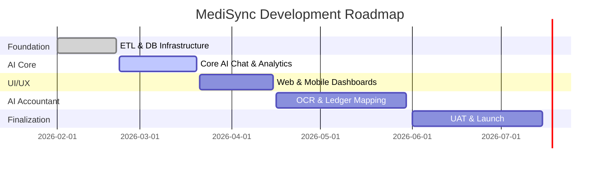

<p align="center">
  
</p>

<h1 align="center">MediSync</h1>

<p align="center">
  <strong>The Interconnected Medical Brain — AI-Powered Conversational BI & Intelligent Accounting</strong>
</p>

<p align="center">
  <a href="https://github.com/veerababumanyam/MediSync/stargazers"></a>
  <a href="https://github.com/veerababumanyam/MediSync/network/members"></a>
  <a href="https://github.com/veerababumanyam/MediSync/blob/main/LICENSE"></a>
</p>

<p align="center">
  
  
  
  
  
  
  
</p>

---

## 🌟 What is MediSync?

MediSync unifies the two core data systems of a healthcare-and-pharmacy business — **HIMS** (clinic operations) and **Tally ERP** (accounting) — into a single AI-powered platform. Instead of dumping CSVs and building spreadsheets, staff simply ask a question in plain language and receive instant charts, tables, and downloadable reports.

### 🚀 Core Modules

| Module | Purpose | Impact |
|:---|:---|:---|
| 🗣️ **Conversational BI** | Natural language queries for live clinical & financial data. | Zero-SQL analytics for everyone. |
| 🤖 **AI Accountant** | Automated OCR, ledger mapping, and one-click Tally sync. | 90% reduction in manual entry. |
| 📊 **Easy Reports** | Pre-built MIS reports and zero-code custom dashboards. | Executive-ready insights in seconds. |
| 🔍 **Search Analytics** | Autonomous AI analyst for trends and recommendations. | Proactive business intelligence. |

---

## 🧠 AI Agent Ecosystem

MediSync is powered by **58 specialized AI agents** orchestrated by the **Google A2A Protocol**.

<details>
<summary><b>Click to expand Agent Details</b></summary>

| ID | Agent | Purpose |
|---|---|---|
| **A-01** | Text-to-SQL | Converts NL to safe, read-only SQL queries. |
| **B-02** | OCR Extraction | High-accuracy field extraction from documents. |
| **B-05** | Ledger Mapping | AI-suggests correct Tally GL ledger. |
| **D-04** | Autonomous Analyst | Runs end-to-end analytical workflows. |
| **E-01** | i18n Router | Detects language and injects locale context. |

*Full agent backlog available in [docs/agents/00-agent-backlog.md](docs/agents/00-agent-backlog.md).*
</details>

---

## 🏗️ Architecture & Principles

MediSync is built for **Precision, Security, and Scalability.**

### 🛠️ The Stack

- **Backend**: Go (API, ETL, Orchestration)
- **Frontend**: React (Web) + Flutter (Mobile)
- **AI**: Google Genkit + Agent ADK + WebMCP
- **Data**: PostgreSQL + pgvector + Redis
- **Auth**: Keycloak + OPA (Policy as Code)

### 💎 Core Principles

- **Decoupled Data Plane**: ETL to a separate warehouse to protect production systems.
- **Read-Only Intelligence**: AI agents have `SELECT`-only access.
- **Human-in-the-Loop (HITL)**: All Tally write-backs require manual approval.
- **i18n by Default**: First-class English (LTR) and Arabic (RTL) support.

---

## 📈 Phased Roadmap



---

## 🚦 Getting Started

### Prerequisites
- Go 1.26+, Node 24+, Flutter 3.42+
- Docker & Docker Compose
- PostgreSQL 18.2 w/ `pgvector`

### Quick Start
```bash
# 1. Start infrastructure
docker-compose up -d

# 2. Setup database
go run ./cmd/migrate

# 3. Start services
go run ./cmd/api & go run ./cmd/etl

# 4. Launch Frontend
cd frontend && npm install && npm run dev
```

---

## 📖 Documentation

Explore our comprehensive guides:
- 🏛️ [Architecture Overview](docs/ARCHITECTURE.md)
- 📝 [Product Requirements (PRD)](docs/PRD.md)
- 🎨 [Design System (DESIGN.md)](docs/DESIGN.md)
- 🌍 [i18n Architecture](docs/i18n-architecture.md)
- 🤖 [Agent Blueprints](docs/agents/BLUEPRINTS.md)

---

<p align="center">
  <strong>MediSync</strong> — Built for healthcare and accounting teams who deserve better than spreadsheets.
  <br/>
  <em>Last Updated: February 21, 2026</em>
</p>
