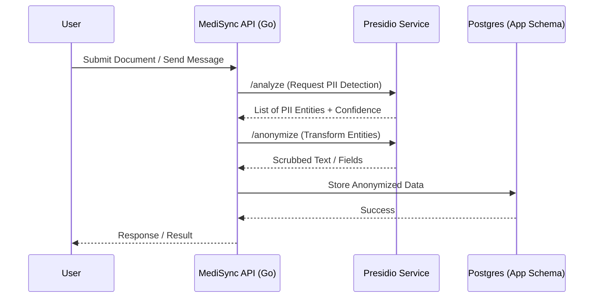

# PII Protection & Anonymization System

This document provides a comprehensive technical guide for the integration of **Microsoft Presidio** into the MediSync platform. It covers the detection and de-identification of sensitive healthcare data across the entire application stack.

---

## 1. Core Objectives
- **HIPAA Compliance**: Ensure no un-anonymized Patient Health Information (PHI) is stored or leaked via AI interactions.
- **Medical Trust**: Build user confidence by demonstrating state-of-the-art privacy protection.
- **Admin Control**: Provide system administrators with granular control over what PII is detected and how it is transformed.

## 2. Technical Architecture

### 2.1 Presidio Integration Flow
MediSync interacts with Microsoft Presidio as a dedicated microservice.

### 2.2 Key Integration Backends
- **`internal/warehouse/chat_message.go`**: Intercepts chat creation to scrub message content.
- **`internal/warehouse/documents.go`**: Scrubs OCR-extracted fields before marking extraction as complete.
- **`internal/api/middleware/pii_scrubber.go`**: A "safety net" middleware that scans outgoing JSON for any accidentally leaked PII.

---

## 3. Administrator Configuration Options

Administrators can configure the system through the **Settings > Security > PII Protection** dashboard.

### 3.1 Global Settings
| Setting | Description | Recommended |
| :--- | :--- | :--- |
| **Enabled** | Master switch for PII protection. | `ON` |
| **Confidence Threshold** | Minimum score (0.0 - 1.0) to trigger an action. | `0.75` |
| **NLP Engine** | Selection of the underlying NLP model. | `Transformers (RoBERTa)` |
| **Log Scrubbing** | Scrub PII from internal audit logs. | `Enabled` |

### 3.2 Entity Configuration
Admins can set individual transformation rules for over 20+ entity types.

| Entity Group | Examples | Default Action |
| :--- | :--- | :--- |
| **General** | Person, Email, Phone, Address | Replace with `<ENTITY>` |
| **Financial** | Credit Card, Bank Account, SWIFT | Mask (Partial) |
| **Healthcare** | Medical Record Number (MRN), Insurance ID | Redact |
| **Geography** | Location, City, ZIP | Redact |

### 3.3 Transformation Operators
- **Redact**: Entirely remove the sensitive information.
- **Replace**: Substitute with a label (e.g., `[PATIENT_NAME]`).
- **Mask**: Replace characters with a wildcard (e.g., `****-****-1234`).
- **Hash**: Create a unique, irreversible signature of the PII.
- **Encrypt**: Securely encrypt PII (allows authorized retrieval).

---

## 4. Advanced Customization

### 4.1 Custom Recognizers
Admins can add domain-specific detection rules:
- **Regex Recognizers**: Define patterns for hospital-specific IDs (e.g., `MS-PAT-[0-9]{5}`).
- **Deny-Lists**: Static lists of words or phrases that should always be flagged.

### 4.2 Conflict Resolution
In cases where PII overlaps (e.g., a Location found within a Person's name), admins can choose:
- **Largest Entity**: Flag the broadest match.
- **Smallest Entity**: Flag the most specific match.
- **All**: Flag every overlapping entity.

---

## 5. Performance & Security

### 5.1 Latency Optimization
- **Asynchronous Execution**: PII scrubbing for large documents occurs in background workers.
- **Local Sidecar Deployment**: Deploying Presidio as a sidecar to the API reduces network overhead.
- **Warmup Patterns**: Pre-loading NLP models into memory for sub-100ms response times.

### 5.2 Infrastructure Isolation
- **No Data Leakage**: Presidio does not store any text it processes.
- **VPC Containment**: All PII detection happens within the secure MediSync network boundaries.
