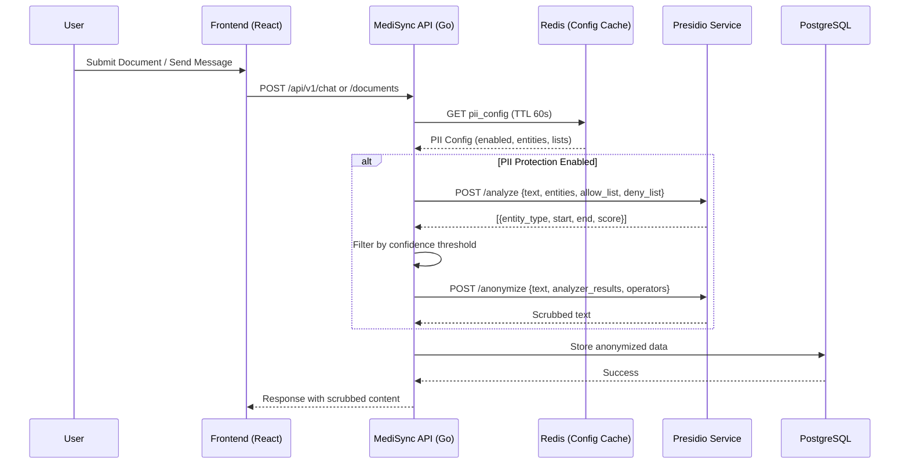
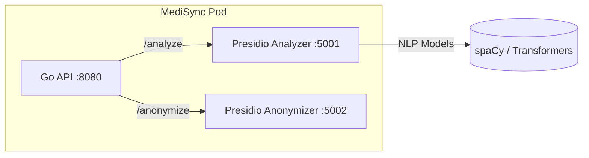
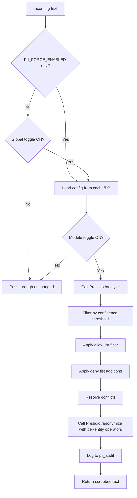

# PII Protection & Anonymization System

**Version:** 2.0.0
**Status:** Implementation-Ready
**Last Updated:** February 22, 2026
**Maintainer:** MediSync Security Team

> This document is the **single source of truth** for PII protection in MediSync. It covers architecture, admin configuration, database schemas, API contracts, frontend UI specifications, and deployment guidance — everything required to build, configure, and operate the system.

---

## Table of Contents

1. [Core Objectives](#1-core-objectives)
2. [Technical Architecture](#2-technical-architecture)
3. [Admin Settings — Enable / Disable](#3-admin-settings--enable--disable)
4. [Admin Settings — Allow & Deny Lists](#4-admin-settings--allow--deny-lists)
5. [Entity Configuration & Transformation Rules](#5-entity-configuration--transformation-rules)
6. [Custom Recognizers](#6-custom-recognizers)
7. [Database Schema (Migration)](#7-database-schema-migration)
8. [REST API Contracts](#8-rest-api-contracts)
9. [Go Backend Service Layer](#9-go-backend-service-layer)
10. [Frontend Admin UI Specification](#10-frontend-admin-ui-specification)
11. [Runtime Behavior & Adaptive System Logic](#11-runtime-behavior--adaptive-system-logic)
12. [Performance & Latency Optimization](#12-performance--latency-optimization)
13. [Audit, Logging & Compliance](#13-audit-logging--compliance)
14. [Testing & Verification Plan](#14-testing--verification-plan)
15. [Deployment & Infrastructure](#15-deployment--infrastructure)

---

## 1. Core Objectives

| Objective | Description |
| :--- | :--- |
| **HIPAA / Saudi PDPL Compliance** | Ensure no un-anonymized Patient Health Information (PHI) is stored or leaked via AI interactions, chat messages, document OCR, or API responses. |
| **Medical Trust** | Build patient and staff confidence through state-of-the-art, visible privacy protection. |
| **Admin Control** | Provide system administrators with a **user-friendly dashboard** to enable/disable PII protection globally or per-module, configure allow/deny lists, and set entity-level transformation rules — all without code changes. |
| **Zero-Downtime Adaptation** | The system adapts in real-time when admins change settings. No restart or redeployment required. |

---

## 2. Technical Architecture

### 2.1 High-Level Data Flow



### 2.2 Component Map

| Component | Path | Responsibility |
| :--- | :--- | :--- |
| **PII Config Service** | `internal/pii/config.go` | Load, cache, and serve PII settings from DB |
| **PII Scrubber** | `internal/pii/scrubber.go` | Core analyze → anonymize pipeline |
| **PII Middleware** | `internal/api/middleware/pii_scrubber.go` | "Safety net" — scans outgoing JSON for leaked PII |
| **Chat Integration** | `internal/warehouse/chat_message.go` | Intercepts chat creation to scrub message content |
| **Document Integration** | `internal/warehouse/documents.go` | Scrubs OCR-extracted fields before persistence |
| **Admin API Handlers** | `internal/api/handlers/pii_settings.go` | CRUD endpoints for admin PII configuration |
| **Admin UI** | `frontend/src/pages/admin/PIISettings.tsx` | React admin panel for PII configuration |
| **Presidio Sidecar** | `docker-compose.yml` | Microsoft Presidio Analyzer + Anonymizer containers |

### 2.3 Presidio Service Topology



**Docker Compose services:**
```yaml
presidio-analyzer:
  image: mcr.microsoft.com/presidio-analyzer:latest
  ports: ["5001:3000"]
  environment:
    - NLP_ENGINE_NAME=transformers
    - MODELS_PATH=/usr/share/presidio-models
  volumes:
    - ./presidio-models:/usr/share/presidio-models
  restart: unless-stopped

presidio-anonymizer:
  image: mcr.microsoft.com/presidio-anonymizer:latest
  ports: ["5002:3000"]
  restart: unless-stopped
```

---

## 3. Admin Settings — Enable / Disable

### 3.1 Overview

Administrators access PII settings through **Settings → Security → PII Protection** in the admin dashboard. The system provides a **master toggle** and **per-module toggles** to control where PII protection is active.

### 3.2 Settings Matrix

| Setting | Type | Default | Description |
| :--- | :--- | :--- | :--- |
| **Global Enable** | Toggle | `ON` | Master switch for all PII protection. When OFF, no scrubbing occurs anywhere. |
| **Chat Scrubbing** | Toggle | `ON` | Scrub PII from all chat messages before storage. |
| **Document OCR Scrubbing** | Toggle | `ON` | Scrub PII from OCR-extracted fields. |
| **API Response Scrubbing** | Toggle | `ON` | "Safety net" middleware on outgoing API responses. |
| **Audit Log Scrubbing** | Toggle | `ON` | Scrub PII from audit log entries. |
| **Export Scrubbing** | Toggle | `ON` | Scrub PII from exported reports/PDFs. |
| **Confidence Threshold** | Slider (0.0–1.0) | `0.75` | Minimum detection score to trigger anonymization. |
| **NLP Engine** | Dropdown | `transformers` | Engine: `spacy`, `transformers` (RoBERTa), or `stanza`. |
| **Conflict Resolution** | Dropdown | `largest_entity` | How overlapping PII detections are resolved: `largest_entity`, `smallest_entity`, `all`. |

### 3.3 Admin UI Behavior

- **Master Toggle OFF** → All per-module toggles are greyed out with a warning banner: *"⚠️ PII Protection is disabled. Patient data will not be anonymized."*
- **Master Toggle ON** → Each module toggle becomes independently configurable.
- Changes take effect **within 60 seconds** (Redis cache TTL) without service restart.
- Every settings change is recorded in the audit log with before/after values.

### 3.4 Environment Variable Overrides

For compliance lockdown, environment variables can **force-enable** PII protection regardless of admin settings:

```env
PII_FORCE_ENABLED=true          # Overrides all admin toggles — always ON
PII_MIN_CONFIDENCE=0.75         # Floor value; admin can set higher but not lower
PII_AUDIT_ALWAYS_SCRUB=true     # Audit logs always scrubbed regardless of toggle
```

> [!CAUTION]
> When `PII_FORCE_ENABLED=true`, the admin UI shows the toggle as locked with a message: *"PII Protection is enforced by system policy and cannot be disabled."*

---

## 4. Admin Settings — Allow & Deny Lists

### 4.1 Concept

| List Type | Purpose | Example |
| :--- | :--- | :--- |
| **Allow List** | Words/phrases that should **never** be flagged as PII, even if the NLP model detects them. | Hospital name "Al Noor Hospital", department names, drug brand names |
| **Deny List** | Words/phrases that should **always** be flagged as PII, regardless of NLP model confidence. | Internal patient ID formats, custom medical codes |

### 4.2 Allow List — Admin UI

The allow list panel provides a user-friendly interface for managing safe terms:

```
┌─────────────────────────────────────────────────────────┐
│  Allow List — Safe Terms                    [+ Add Term]│
│─────────────────────────────────────────────────────────│
│  🔍 Search terms...                                     │
│                                                         │
│  ┌─────────────────────────────────────────────────────┐│
│  │ Term              │ Entity Type │ Added By │ Actions││
│  │───────────────────│─────────────│──────────│────────││
│  │ Al Noor Hospital  │ PERSON      │ Admin    │ ✏️ 🗑️  ││
│  │ MediSync          │ ORG         │ System   │ ✏️ 🗑️  ││
│  │ Dr. Ahmed         │ PERSON      │ Admin    │ ✏️ 🗑️  ││
│  │ Riyadh            │ LOCATION    │ Admin    │ ✏️ 🗑️  ││
│  │ Cardiology Dept   │ ORG         │ System   │ ✏️ 🗑️  ││
│  └─────────────────────────────────────────────────────┘│
│                                                         │
│  Bulk Actions:  [Import CSV]  [Export CSV]  [Clear All] │
│                                                         │
│  ┌── Add New Term ─────────────────────────────────────┐│
│  │ Term:        [________________________]             ││
│  │ Entity Type: [▼ Select entity type    ]             ││
│  │ Notes:       [________________________]             ││
│  │                              [Cancel] [Add to List] ││
│  └─────────────────────────────────────────────────────┘│
└─────────────────────────────────────────────────────────┘
```

**Features:**
- **Search & Filter**: Real-time search across all allow-list entries.
- **Entity Type Scoping**: Each allow entry is scoped to a specific entity type (e.g., "Riyadh" is allowed as `LOCATION` but still flagged if detected as something else).
- **Bulk Import/Export**: CSV upload/download for bulk management.
- **Audit Trail**: Every add/edit/delete is logged with user and timestamp.

### 4.3 Deny List — Admin UI

The deny list panel allows admins to add custom terms that should always be detected:

```
┌─────────────────────────────────────────────────────────┐
│  Deny List — Always Flag                    [+ Add Rule]│
│─────────────────────────────────────────────────────────│
│  🔍 Search rules...                                     │
│                                                         │
│  ┌─────────────────────────────────────────────────────┐│
│  │ Pattern           │ Type    │ Entity     │ Actions  ││
│  │───────────────────│─────────│────────────│──────────││
│  │ MS-PAT-\d{5}      │ Regex   │ CUSTOM_MRN │ ✏️ 🗑️ 🧪││
│  │ HIMS-\d{8}        │ Regex   │ CUSTOM_ID  │ ✏️ 🗑️ 🧪││
│  │ 123-45-6789       │ Literal │ US_SSN     │ ✏️ 🗑️ 🧪││
│  │ iqama-\d{10}      │ Regex   │ SA_IQAMA   │ ✏️ 🗑️ 🧪││
│  └─────────────────────────────────────────────────────┘│
│                                                         │
│  🧪 = Test this pattern against sample text             │
│                                                         │
│  ┌── Add New Deny Rule ────────────────────────────────┐│
│  │ Pattern:     [________________________]             ││
│  │ Type:        (●) Regex  (○) Literal                 ││
│  │ Entity Name: [________________________]             ││
│  │ Action:      [▼ Redact                ]             ││
│  │ Test Text:   [________________________]             ││
│  │ Test Result: ✅ 2 matches found                      ││
│  │                              [Cancel] [Add Rule]    ││
│  └─────────────────────────────────────────────────────┘│
└─────────────────────────────────────────────────────────┘
```

**Features:**
- **Pattern Types**: Literal string match or Regex pattern.
- **Live Testing**: Admins can paste sample text and see matches before saving.
- **Custom Entity Names**: Each deny-list rule creates a new entity type (prefixed `CUSTOM_`).
- **Per-Rule Transformation**: Each deny-list rule specifies its own anonymization action.
- **Bulk Import/Export**: CSV upload/download.

### 4.4 System-Seeded Defaults

On first setup, the system auto-populates smart defaults:

**Default Allow List:**
| Term | Entity Type | Reason |
| :--- | :--- | :--- |
| Organization name (from settings) | `ORG` | Hospital name appears everywhere |
| Department names (from DB) | `ORG` | Auto-synced from `hims_analytics.dim_departments` |
| Doctor names (from DB) | `PERSON` | Auto-synced from `hims_analytics.dim_doctors` (configurable) |
| "Saudi Arabia", "Riyadh" | `LOCATION` | Common geographic context |

**Default Deny List:**
| Pattern | Type | Entity |
| :--- | :--- | :--- |
| `\b\d{10}\b` | Regex | `SA_IQAMA` (Saudi Iqama Number) |
| `\b\d{3}-\d{2}-\d{4}\b` | Regex | `US_SSN` |
| `MS-PAT-\d{5,}` | Regex | `MEDISYNC_MRN` (MediSync Patient ID) |

---

## 5. Entity Configuration & Transformation Rules

### 5.1 Supported Entity Types

Admins can toggle detection and choose a transformation operator for each entity type:

| Entity Group | Entity Types | Default Enabled | Default Action |
| :--- | :--- | :--- | :--- |
| **Personal** | `PERSON`, `EMAIL_ADDRESS`, `PHONE_NUMBER`, `DATE_OF_BIRTH` | ✅ | Replace |
| **Financial** | `CREDIT_CARD`, `IBAN_CODE`, `SWIFT_CODE`, `CRYPTO` | ✅ | Mask |
| **Healthcare** | `MEDICAL_LICENSE`, `NRP` (National Registration), custom MRN | ✅ | Redact |
| **Geographic** | `LOCATION`, `IP_ADDRESS`, `URL` | ✅ | Redact |
| **Identity** | `US_SSN`, `UK_NHS`, `SG_NRIC_FIN`, `AU_ABN`, `AU_ACN`, `SA_IQAMA` | ✅ | Redact |
| **Custom** | User-defined via deny list | Varies | Per-rule |

### 5.2 Transformation Operators

| Operator | Description | Example Input | Example Output |
| :--- | :--- | :--- | :--- |
| **Redact** | Remove entirely | `Patient John Smith called` | `Patient called` |
| **Replace** | Label substitution | `Patient John Smith called` | `Patient [PERSON] called` |
| **Mask** | Partial character hide | `4111-1111-1111-1234` | `****-****-****-1234` |
| **Hash (SHA-256)** | Irreversible fingerprint | `john@mail.com` | `a8f5f167...` |
| **Encrypt (AES-256-GCM)** | Reversible (authorized users only) | `john@mail.com` | `enc:v1:aGVsbG8=` |

### 5.3 Admin UI — Entity Configuration Panel

```
┌─────────────────────────────────────────────────────────┐
│  Entity Detection & Transformation Rules                │
│─────────────────────────────────────────────────────────│
│                                                         │
│  ┌── Personal ─────────────────────────────────────────┐│
│  │ ☑ PERSON           [▼ Replace  ] [▼ [PERSON]     ] ││
│  │ ☑ EMAIL_ADDRESS    [▼ Replace  ] [▼ [EMAIL]      ] ││
│  │ ☑ PHONE_NUMBER     [▼ Mask     ] [▼ Last 4 digits] ││
│  │ ☑ DATE_OF_BIRTH    [▼ Redact   ]                   ││
│  └─────────────────────────────────────────────────────┘│
│                                                         │
│  ┌── Financial ────────────────────────────────────────┐│
│  │ ☑ CREDIT_CARD      [▼ Mask     ] [▼ Last 4 digits] ││
│  │ ☑ IBAN_CODE        [▼ Mask     ] [▼ Last 4 chars ] ││
│  │ ☐ CRYPTO           [▼ Redact   ]                   ││
│  └─────────────────────────────────────────────────────┘│
│                                                         │
│  ┌── Healthcare ───────────────────────────────────────┐│
│  │ ☑ MEDICAL_LICENSE  [▼ Redact   ]                   ││
│  │ ☑ MEDISYNC_MRN     [▼ Hash     ]                   ││
│  └─────────────────────────────────────────────────────┘│
│                                                         │
│                           [Reset Defaults] [Save]       │
└─────────────────────────────────────────────────────────┘
```

---

## 6. Custom Recognizers

### 6.1 Regex Recognizers

Defined through the deny list (Section 4.3). Each regex rule is compiled into a Presidio `PatternRecognizer` at runtime.

**Presidio JSON equivalent:**
```json
{
  "name": "MediSync MRN Recognizer",
  "supported_language": "en",
  "supported_entity": "MEDISYNC_MRN",
  "patterns": [
    {
      "name": "medisync_mrn_pattern",
      "regex": "MS-PAT-\\d{5,}",
      "score": 0.95
    }
  ],
  "context": ["patient", "mrn", "record", "id"]
}
```

### 6.2 Context-Enhanced Detection

Presidio supports context words that boost detection confidence. The admin can optionally provide context words per deny-list rule:

| Deny Rule | Context Words | Effect |
| :--- | :--- | :--- |
| `MS-PAT-\d{5}` | `patient, mrn, medical, record` | Score boosted from 0.6 → 0.95 when context words surround the match |
| `\b\d{10}\b` | `iqama, resident, id, national` | Avoids false positives on 10-digit numbers not near identity context |

### 6.3 Conflict Resolution Strategies

| Strategy | Behavior | Best For |
| :--- | :--- | :--- |
| **Largest Entity** | Keep the broadest overlapping match | Fewer false positives, simple outputs |
| **Smallest Entity** | Keep the most specific matches | Precision with sub-entity handling |
| **All** | Flag every overlapping entity | Maximum coverage (auditing mode) |

---

## 7. Database Schema (Migration)

**File:** `migrations/016_pii_settings.up.sql`

```sql
-- ============================================================================
-- Migration 016: PII Protection Settings
-- ============================================================================

-- Global PII configuration (singleton row per tenant)
CREATE TABLE app.pii_settings (
    id UUID PRIMARY KEY DEFAULT uuid_generate_v4(),

    -- Master toggle
    is_enabled              BOOLEAN NOT NULL DEFAULT TRUE,

    -- Per-module toggles
    chat_scrubbing          BOOLEAN NOT NULL DEFAULT TRUE,
    document_scrubbing      BOOLEAN NOT NULL DEFAULT TRUE,
    api_response_scrubbing  BOOLEAN NOT NULL DEFAULT TRUE,
    audit_log_scrubbing     BOOLEAN NOT NULL DEFAULT TRUE,
    export_scrubbing        BOOLEAN NOT NULL DEFAULT TRUE,

    -- Detection configuration
    confidence_threshold    DECIMAL(3,2) NOT NULL DEFAULT 0.75
        CHECK (confidence_threshold >= 0.0 AND confidence_threshold <= 1.0),
    nlp_engine              VARCHAR(50) NOT NULL DEFAULT 'transformers'
        CHECK (nlp_engine IN ('spacy', 'transformers', 'stanza')),
    conflict_resolution     VARCHAR(50) NOT NULL DEFAULT 'largest_entity'
        CHECK (conflict_resolution IN ('largest_entity', 'smallest_entity', 'all')),

    -- Metadata
    updated_by              UUID REFERENCES app.users(user_id),
    created_at              TIMESTAMPTZ NOT NULL DEFAULT NOW(),
    updated_at              TIMESTAMPTZ NOT NULL DEFAULT NOW()
);

-- Seed default row
INSERT INTO app.pii_settings (id, is_enabled) VALUES (uuid_generate_v4(), TRUE);

-- Entity transformation rules
CREATE TABLE app.pii_entity_rules (
    id              UUID PRIMARY KEY DEFAULT uuid_generate_v4(),
    entity_type     VARCHAR(100) NOT NULL UNIQUE,      -- e.g. PERSON, EMAIL_ADDRESS
    entity_group    VARCHAR(50) NOT NULL,               -- personal, financial, healthcare, geographic, identity, custom
    is_enabled      BOOLEAN NOT NULL DEFAULT TRUE,
    operator        VARCHAR(50) NOT NULL DEFAULT 'replace'
        CHECK (operator IN ('redact', 'replace', 'mask', 'hash', 'encrypt')),
    operator_params JSONB DEFAULT '{}',                 -- e.g. {"masking_char":"*","chars_to_mask":12,"from_end":false}
    replace_label   VARCHAR(100),                       -- e.g. [PERSON], [EMAIL]
    display_order   INTEGER DEFAULT 0,
    created_at      TIMESTAMPTZ NOT NULL DEFAULT NOW(),
    updated_at      TIMESTAMPTZ NOT NULL DEFAULT NOW()
);

-- Seed default entity rules
INSERT INTO app.pii_entity_rules (entity_type, entity_group, operator, replace_label) VALUES
    ('PERSON',           'personal',   'replace', '[PERSON]'),
    ('EMAIL_ADDRESS',    'personal',   'replace', '[EMAIL]'),
    ('PHONE_NUMBER',     'personal',   'mask',     NULL),
    ('DATE_OF_BIRTH',    'personal',   'redact',   NULL),
    ('CREDIT_CARD',      'financial',  'mask',     NULL),
    ('IBAN_CODE',        'financial',  'mask',     NULL),
    ('SWIFT_CODE',       'financial',  'mask',     NULL),
    ('CRYPTO',           'financial',  'redact',   NULL),
    ('MEDICAL_LICENSE',  'healthcare', 'redact',   NULL),
    ('NRP',              'healthcare', 'redact',   NULL),
    ('LOCATION',         'geographic', 'redact',   NULL),
    ('IP_ADDRESS',       'geographic', 'redact',   NULL),
    ('URL',              'geographic', 'redact',   NULL),
    ('US_SSN',           'identity',   'redact',   NULL),
    ('UK_NHS',           'identity',   'redact',   NULL);

-- Allow list (terms that should never be flagged)
CREATE TABLE app.pii_allow_list (
    id              UUID PRIMARY KEY DEFAULT uuid_generate_v4(),
    term            VARCHAR(500) NOT NULL,
    entity_type     VARCHAR(100) NOT NULL,              -- scoped to specific entity type
    notes           TEXT,
    is_auto_synced  BOOLEAN DEFAULT FALSE,              -- TRUE if auto-populated from HIMS data
    source_table    VARCHAR(255),                       -- e.g. hims_analytics.dim_departments
    added_by        UUID REFERENCES app.users(user_id),
    created_at      TIMESTAMPTZ NOT NULL DEFAULT NOW(),
    CONSTRAINT uq_pii_allow_list UNIQUE (term, entity_type)
);

CREATE INDEX idx_pii_allow_list_entity ON app.pii_allow_list(entity_type);

-- Deny list (custom patterns that should always be flagged)
CREATE TABLE app.pii_deny_list (
    id              UUID PRIMARY KEY DEFAULT uuid_generate_v4(),
    pattern         VARCHAR(1000) NOT NULL,
    pattern_type    VARCHAR(20) NOT NULL DEFAULT 'regex'
        CHECK (pattern_type IN ('regex', 'literal')),
    entity_name     VARCHAR(100) NOT NULL,              -- custom entity name, e.g. MEDISYNC_MRN
    operator        VARCHAR(50) NOT NULL DEFAULT 'redact'
        CHECK (operator IN ('redact', 'replace', 'mask', 'hash', 'encrypt')),
    operator_params JSONB DEFAULT '{}',
    replace_label   VARCHAR(100),
    context_words   TEXT[],                             -- words that boost confidence
    confidence      DECIMAL(3,2) DEFAULT 0.95,
    notes           TEXT,
    is_active       BOOLEAN DEFAULT TRUE,
    added_by        UUID REFERENCES app.users(user_id),
    created_at      TIMESTAMPTZ NOT NULL DEFAULT NOW(),
    updated_at      TIMESTAMPTZ NOT NULL DEFAULT NOW(),
    CONSTRAINT uq_pii_deny_list UNIQUE (pattern, entity_name)
);

CREATE INDEX idx_pii_deny_list_entity ON app.pii_deny_list(entity_name);
CREATE INDEX idx_pii_deny_list_active ON app.pii_deny_list(is_active);

-- PII detection audit log (what was detected and scrubbed)
CREATE TABLE app.pii_audit (
    id              UUID PRIMARY KEY DEFAULT uuid_generate_v4(),
    request_id      VARCHAR(255),                       -- correlation with API request
    module          VARCHAR(50) NOT NULL,               -- chat, document, api_response, export
    original_hash   VARCHAR(64),                        -- SHA-256 of original text (no PII stored)
    entities_found  JSONB NOT NULL,                     -- [{entity_type, score, start, end, operator_applied}]
    entities_count  INTEGER NOT NULL DEFAULT 0,
    scrub_time_ms   INTEGER,                            -- processing duration
    user_id         UUID REFERENCES app.users(user_id),
    created_at      TIMESTAMPTZ NOT NULL DEFAULT NOW()
);

CREATE INDEX idx_pii_audit_module ON app.pii_audit(module);
CREATE INDEX idx_pii_audit_created ON app.pii_audit(created_at);
CREATE INDEX idx_pii_audit_user ON app.pii_audit(user_id);
CREATE INDEX idx_pii_audit_request ON app.pii_audit(request_id);
```

**Down migration:** `migrations/016_pii_settings.down.sql`

```sql
DROP TABLE IF EXISTS app.pii_audit;
DROP TABLE IF EXISTS app.pii_deny_list;
DROP TABLE IF EXISTS app.pii_allow_list;
DROP TABLE IF EXISTS app.pii_entity_rules;
DROP TABLE IF EXISTS app.pii_settings;
```

---

## 8. REST API Contracts

All endpoints require Keycloak authentication. PII settings endpoints require `admin` or `security_admin` role.

### 8.1 PII Settings

#### `GET /api/v1/admin/pii/settings`

Returns the current PII configuration.

**Response `200 OK`:**
```json
{
  "is_enabled": true,
  "is_force_locked": false,
  "chat_scrubbing": true,
  "document_scrubbing": true,
  "api_response_scrubbing": true,
  "audit_log_scrubbing": true,
  "export_scrubbing": true,
  "confidence_threshold": 0.75,
  "nlp_engine": "transformers",
  "conflict_resolution": "largest_entity",
  "updated_by": "admin@medisync.com",
  "updated_at": "2026-02-22T09:00:00Z"
}
```

#### `PUT /api/v1/admin/pii/settings`

Update PII settings. Returns `403` if `PII_FORCE_ENABLED=true` and the request attempts to disable.

**Request:**
```json
{
  "is_enabled": true,
  "chat_scrubbing": true,
  "document_scrubbing": false,
  "confidence_threshold": 0.80,
  "nlp_engine": "transformers",
  "conflict_resolution": "largest_entity"
}
```

**Response `200 OK`:** Updated settings object.

### 8.2 Entity Rules

#### `GET /api/v1/admin/pii/entities`

```json
{
  "entities": [
    {
      "id": "uuid",
      "entity_type": "PERSON",
      "entity_group": "personal",
      "is_enabled": true,
      "operator": "replace",
      "replace_label": "[PERSON]",
      "operator_params": {}
    }
  ]
}
```

#### `PUT /api/v1/admin/pii/entities/:id`

```json
{
  "is_enabled": true,
  "operator": "mask",
  "operator_params": {"masking_char": "*", "chars_to_mask": 12}
}
```

### 8.3 Allow List

| Method | Endpoint | Description |
| :--- | :--- | :--- |
| `GET` | `/api/v1/admin/pii/allow-list` | List all entries (supports `?search=`, `?entity_type=`, `?page=`, `?limit=`) |
| `POST` | `/api/v1/admin/pii/allow-list` | Add single entry |
| `POST` | `/api/v1/admin/pii/allow-list/bulk` | Bulk import (CSV or JSON array) |
| `PUT` | `/api/v1/admin/pii/allow-list/:id` | Update entry |
| `DELETE` | `/api/v1/admin/pii/allow-list/:id` | Delete entry |
| `GET` | `/api/v1/admin/pii/allow-list/export` | Export as CSV |

**POST body:**
```json
{
  "term": "Al Noor Hospital",
  "entity_type": "ORG",
  "notes": "Our hospital name — should never be flagged"
}
```

### 8.4 Deny List

| Method | Endpoint | Description |
| :--- | :--- | :--- |
| `GET` | `/api/v1/admin/pii/deny-list` | List all rules |
| `POST` | `/api/v1/admin/pii/deny-list` | Add single rule |
| `POST` | `/api/v1/admin/pii/deny-list/bulk` | Bulk import |
| `PUT` | `/api/v1/admin/pii/deny-list/:id` | Update rule |
| `DELETE` | `/api/v1/admin/pii/deny-list/:id` | Delete rule |
| `POST` | `/api/v1/admin/pii/deny-list/test` | Test a pattern against sample text |
| `GET` | `/api/v1/admin/pii/deny-list/export` | Export as CSV |

**Test endpoint:**
```json
// Request
{
  "pattern": "MS-PAT-\\d{5}",
  "pattern_type": "regex",
  "test_text": "Patient MS-PAT-12345 admitted to ward MS-PAT-67890"
}

// Response 200
{
  "matches": [
    {"start": 8, "end": 21, "match": "MS-PAT-12345"},
    {"start": 39, "end": 52, "match": "MS-PAT-67890"}
  ],
  "count": 2
}
```

### 8.5 PII Audit & Analytics

| Method | Endpoint | Description |
| :--- | :--- | :--- |
| `GET` | `/api/v1/admin/pii/audit` | Paginated audit log of all PII detections |
| `GET` | `/api/v1/admin/pii/stats` | Aggregate statistics (entities detected per day, module breakdown) |

**Stats response:**

```json
{
  "period": "last_30_days",
  "total_scrubs": 14523,
  "entities_detected": 42891,
  "by_module": {
    "chat": 8234,
    "document": 5102,
    "api_response": 1187
  },
  "by_entity_type": {
    "PERSON": 18234,
    "EMAIL_ADDRESS": 9102,
    "PHONE_NUMBER": 7891
  },
  "avg_scrub_time_ms": 45
}
```

---

## 9. Go Backend Service Layer

### 9.1 Package Structure

```
internal/pii/
├── config.go          # PIIConfig struct + DB/cache loader
├── scrubber.go        # Core Presidio client (analyze + anonymize)
├── middleware.go       # HTTP middleware for response scrubbing
├── recognizers.go      # Build custom recognizers from deny list
├── sync.go            # Auto-sync allow list from HIMS data
└── pii_test.go        # Unit + integration tests
```

### 9.2 Config Service (Pseudocode)

```go
// config.go

type PIIConfig struct {
    IsEnabled            bool       `json:"is_enabled"`
    ChatScrubbing        bool       `json:"chat_scrubbing"`
    DocumentScrubbing    bool       `json:"document_scrubbing"`
    APIResponseScrubbing bool       `json:"api_response_scrubbing"`
    AuditLogScrubbing    bool       `json:"audit_log_scrubbing"`
    ExportScrubbing      bool       `json:"export_scrubbing"`
    ConfidenceThreshold  float64    `json:"confidence_threshold"`
    NLPEngine            string     `json:"nlp_engine"`
    ConflictResolution   string     `json:"conflict_resolution"`
    EntityRules          []EntityRule `json:"entity_rules"`
    AllowList            map[string][]string `json:"allow_list"` // entity_type -> []terms
    DenyPatterns         []DenyPattern       `json:"deny_patterns"`
}

// GetConfig loads config from Redis cache, or DB fallback
func (s *PIIConfigService) GetConfig(ctx context.Context) (*PIIConfig, error) {
    // 1. Check Redis cache (key: "pii:config", TTL: 60s)
    // 2. If miss → load from app.pii_settings + app.pii_entity_rules
    //    + app.pii_allow_list + app.pii_deny_list
    // 3. Apply env var overrides (PII_FORCE_ENABLED, PII_MIN_CONFIDENCE)
    // 4. Cache and return
}

// InvalidateCache forces re-read on next request (called after admin updates)
func (s *PIIConfigService) InvalidateCache(ctx context.Context) error {
    return s.redis.Del(ctx, "pii:config").Err()
}
```

### 9.3 Scrubber Service (Pseudocode)

```go
// scrubber.go

type ScrubResult struct {
    ScrubbedText    string         `json:"scrubbed_text"`
    EntitiesFound   []DetectedEntity `json:"entities_found"`
    ProcessingTimeMs int           `json:"processing_time_ms"`
}

func (s *Scrubber) Scrub(ctx context.Context, text string, module string) (*ScrubResult, error) {
    config, err := s.configService.GetConfig(ctx)
    if err != nil { return nil, err }

    // Check if globally or module-specifically disabled
    if !config.IsEnabled || !config.IsModuleEnabled(module) {
        return &ScrubResult{ScrubbedText: text}, nil
    }

    // 1. Build analyze request with enabled entities, allow/deny lists
    // 2. POST to Presidio /analyze
    // 3. Filter results by confidence threshold
    // 4. Apply conflict resolution strategy
    // 5. Build anonymize request with per-entity operators
    // 6. POST to Presidio /anonymize
    // 7. Log to app.pii_audit
    // 8. Return scrubbed text
}
```

---

## 10. Frontend Admin UI Specification

### 10.1 Page: Admin → Security → PII Protection

**File:** `frontend/src/pages/admin/PIISettings.tsx`

**Layout:** Full-width admin page with tabbed sections inside a `LiquidGlassCard`.

```
┌─────────────────────────────────────────────────────────────┐
│  🛡️ PII Protection Settings                                │
│─────────────────────────────────────────────────────────────│
│                                                             │
│  PII Protection   ●━━━━━━━━━━━━━━● ON                      │
│  ℹ️ All patient data is scrubbed before storage.             │
│                                                             │
│  ┌──────┬────────────┬───────────┬───────────┬─────────┐    │
│  │Config│ Entities   │Allow List │ Deny List │ Audit   │    │
│  └──────┴────────────┴───────────┴───────────┴─────────┘    │
│                                                             │
│  ┌─ General Configuration ─────────────────────────────────┐│
│  │                                                          ││
│  │  Chat Scrubbing      ●━━● ON                            ││
│  │  Document Scrubbing  ●━━● ON                            ││
│  │  API Resp. Scrubbing ●━━● ON                            ││
│  │  Audit Log Scrubbing ●━━● ON                            ││
│  │  Export Scrubbing    ●━━● ON                            ││
│  │                                                          ││
│  │  Confidence Threshold ───●────── 0.75                   ││
│  │                      0.0         1.0                    ││
│  │                                                          ││
│  │  NLP Engine     [▼ Transformers (RoBERTa)  ]            ││
│  │  Conflict Mode  [▼ Largest Entity          ]            ││
│  │                                                          ││
│  │                               [Reset Defaults] [Save]   ││
│  └──────────────────────────────────────────────────────────┘│
└─────────────────────────────────────────────────────────────┘
```

### 10.2 Tab: Allow List

Sortable, searchable data table with inline add and CSV bulk-import modal. Uses `LiquidGlassCard` containers and `LiquidGlassInput` components.

### 10.3 Tab: Deny List

Similar to Allow List, plus:
- **"🧪 Test"** button per row opens a slide-over panel with a textarea + real-time match preview.
- **Pattern Type** toggle (Regex / Literal) with dynamic validation.

### 10.4 Tab: Audit Dashboard

Analytics cards showing:
- **Total PII Detections** (last 7/30/90 days)
- **By Module** (pie chart)
- **By Entity Type** (bar chart)
- **Average Scrub Latency** (line chart trending over time)
- Charts use **Apache ECharts** per the MediSync design system.

### 10.5 Accessibility & i18n

- All labels have `aria-label` attributes and support both EN/AR.
- Toggle descriptions include SR-only text: *"Enable or disable PII scrubbing for chat messages"*.
- Forms follow the `LiquidGlassInput` component pattern (Section 12 of `DESIGN.md`).
- RTL layout support for Arabic locale.

---

## 11. Runtime Behavior & Adaptive System Logic

### 11.1 Decision Tree



### 11.2 Configuration Hot-Reload

1. Admin saves new settings via the UI.
2. API handler persists to `app.pii_settings` and invalidates Redis cache key `pii:config`.
3. Next request (within ~1s) triggers a cache miss → fresh config is loaded.
4. Custom recognizers are rebuilt from the deny list and pushed to Presidio via `POST /recognizers` (Presidio's registry API).

### 11.3 Allow List Integration with Presidio

The allow list is passed as `ad_hoc_recognizers` context in the `/analyze` request:

```json
{
  "text": "Dr. Ahmed at Al Noor Hospital",
  "language": "en",
  "entities": ["PERSON", "ORG", "LOCATION"],
  "ad_hoc_recognizers": [],
  "context": [],
  "score_threshold": 0.75,
  "return_decision_process": false,
  "allow_list": ["Al Noor Hospital", "Dr. Ahmed"]
}
```

### 11.4 Deny List Integration with Presidio

Deny list patterns are registered as `PatternRecognizer` objects:

```json
POST /recognizers
{
  "value": [
    {
      "name": "MediSync MRN",
      "supported_language": "en",
      "supported_entity": "MEDISYNC_MRN",
      "deny_list": [],
      "patterns": [
        {"name": "mrn", "regex": "MS-PAT-\\d{5,}", "score": 0.95}
      ],
      "context": ["patient", "mrn", "record"]
    }
  ]
}
```

---

## 12. Performance & Latency Optimization

| Strategy | Details | Target |
| :--- | :--- | :--- |
| **Redis Config Cache** | PII config cached with 60s TTL; invalidated on admin save | < 1ms config lookup |
| **Connection Pooling** | HTTP connection pool to Presidio (max 20 connections) | Avoid TCP handshake per request |
| **Async Document Scrubbing** | Large documents (>10KB) processed via NATS background worker | Non-blocking upload response |
| **Model Warmup** | Pre-load NLP models on Presidio startup via health-check probes | Sub-100ms first request |
| **Batch Analysis** | Batch multiple short texts into single `/analyze` call | Reduce round-trips |
| **Sidecar Deployment** | Presidio containers in same pod as Go API | ~2ms network latency |
| **Circuit Breaker** | If Presidio is down, fail-open with audit alert or fail-closed (configurable) | Zero data leaks on failure |

### 12.1 Failure Modes

| Scenario | Default Behavior | Admin Override |
| :--- | :--- | :--- |
| Presidio unavailable | **Fail-closed**: reject the request, return `503` | Can set to **fail-open** (pass data through, log alert) |
| Scrub latency > 5s | Timeout and return `504` | Configurable timeout (1–30s) |
| Invalid regex in deny list | Skip that pattern, log warning | Visual error in admin UI on save |

---

## 13. Audit, Logging & Compliance

### 13.1 Audit Trail

Every PII operation is logged to `app.pii_audit`:

| Field | Description |
| :--- | :--- |
| `request_id` | Correlates with the API request log |
| `module` | Where scrubbing occurred (chat, document, api_response, export) |
| `entities_found` | JSON array of detected entities with types, scores, and operators applied |
| `entities_count` | Total entities detected |
| `scrub_time_ms` | Processing duration |
| `user_id` | User who triggered the action |

### 13.2 Settings Change Audit

All PII settings changes are recorded in the existing `app.audit_log` table:

```json
{
  "action": "update",
  "resource": "pii_settings",
  "changes_json": {
    "before": {"confidence_threshold": 0.75, "chat_scrubbing": true},
    "after":  {"confidence_threshold": 0.80, "chat_scrubbing": false}
  }
}
```

### 13.3 Compliance Reports

The admin dashboard provides downloadable compliance reports:

- **Monthly PII Summary**: Total detections, types, modules — for HIPAA/PDPL audit.
- **Allow/Deny List Change Log**: All modifications with timestamps and users.
- **Coverage Report**: Percentage of data flows with active PII protection.

---

## 14. Testing & Verification Plan

### 14.1 Unit Tests

| Test | File | Description |
| :--- | :--- | :--- |
| Config loading | `internal/pii/pii_test.go` | Verify DB → cache → env override precedence |
| Allow list filtering | `internal/pii/pii_test.go` | Confirm allowed terms are excluded from results |
| Deny list compilation | `internal/pii/pii_test.go` | Regex patterns compile and match correctly |
| Force-enable override | `internal/pii/pii_test.go` | Verify `PII_FORCE_ENABLED` cannot be overridden by admin |
| Module toggle isolation | `internal/pii/pii_test.go` | Disabling chat scrubbing doesn't affect document scrubbing |

### 14.2 Integration Tests

| Test | Description |
| :--- | :--- |
| **End-to-end scrub** | Submit chat with PII → verify stored message is scrubbed |
| **Admin API CRUD** | Full lifecycle of allow/deny list entries via API |
| **Presidio failure** | Stop Presidio → verify fail-closed behavior |
| **Settings hot-reload** | Change threshold via API → verify next scrub uses new value |
| **Bulk CSV import** | Upload 1000-row CSV → verify all entries created |

### 14.3 Browser Tests

| Test | Description |
| :--- | :--- |
| Master toggle ON/OFF | Verify module toggles grey out when master is OFF |
| Deny list regex test | Enter pattern → click Test → verify matches highlighted |
| Allow list search | Type term → verify table filters in real-time |
| Locked state | Set `PII_FORCE_ENABLED=true` → verify toggle is read-only |

---

## 15. Deployment & Infrastructure

### 15.1 Docker Compose (Development)

```yaml
services:
  presidio-analyzer:
    image: mcr.microsoft.com/presidio-analyzer:latest
    ports: ["5001:3000"]
    environment:
      NLP_ENGINE_NAME: transformers
    healthcheck:
      test: ["CMD", "curl", "-f", "http://localhost:3000/health"]
      interval: 30s
      timeout: 10s
      retries: 3

  presidio-anonymizer:
    image: mcr.microsoft.com/presidio-anonymizer:latest
    ports: ["5002:3000"]
    healthcheck:
      test: ["CMD", "curl", "-f", "http://localhost:3000/health"]
      interval: 30s
      timeout: 10s
      retries: 3
```

### 15.2 Kubernetes (Production)

- Presidio deployed as a **sidecar container** in the MediSync API pod.
- Resource limits: `256Mi` RAM, `500m` CPU per Presidio container.
- Model volume mounted from a PersistentVolumeClaim for fast startup.
- **NetworkPolicy**: Only the Go API can reach Presidio — no external access.

### 15.3 Environment Variables

| Variable | Default | Description |
| :--- | :--- | :--- |
| `PRESIDIO_ANALYZER_URL` | `http://localhost:5001` | Analyzer service URL |
| `PRESIDIO_ANONYMIZER_URL` | `http://localhost:5002` | Anonymizer service URL |
| `PII_FORCE_ENABLED` | `false` | Force PII protection ON regardless of admin toggle |
| `PII_MIN_CONFIDENCE` | `0.0` | Minimum confidence floor (admin can go higher, not lower) |
| `PII_AUDIT_ALWAYS_SCRUB` | `false` | Always scrub audit logs regardless of toggle |
| `PII_FAILURE_MODE` | `closed` | `closed` (reject request) or `open` (pass through + alert) |
| `PII_TIMEOUT_MS` | `5000` | Presidio call timeout in milliseconds |
| `PII_CACHE_TTL_SECONDS` | `60` | Config cache TTL in Redis |

---

> [!IMPORTANT]
> This document is the specification for the PII protection system. All implementations must conform to the schemas, APIs, and behaviors described here. Any deviations require an update to this document first.
